# Airflow on AWS ECS Fargate

This exercise deploys Apache Airflow on AWS ECS Fargate using the Celery Executor and Terraform. The objective is to evaluate a scalable Airflow architecture that supports distributed task execution, Git-based DAG deployment while maintaining a fully containerized and serverless infrastructure.

Finally, a simple dag is deployed on Airflow to integrate dbt for data transformation in Snowflake.
## Architecture Goals
- Deploy Airflow 3.2 on ECS Fargate  
- Scale task execution using Celery Executor
- Enable Git-based DAG deployment workflow
- Store DAG repo persistently on Amazon EFS  
- Provision all infrastructure with Terraform  
- Separate Airflow services into independent ECS tasks:  
	- API Server  
	- Scheduler  
	- Worker(s)
	- Triggerer  
	- DAG Processor  
- Integrate dbt for data transformation in Snowflake

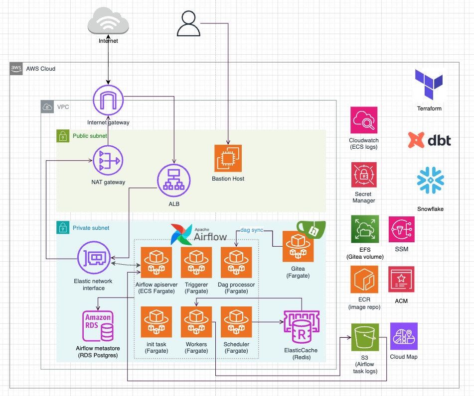
### Building Blocks
- Application Load Balancer (ALB) in public subnets for Airflow UI access  
- Internet Gateway and NAT Gateway for internet connectivity  
- ECS Fargate services deployed in private subnets  
- Amazon RDS PostgreSQL as the Airflow metadata database  
- Amazon ElastiCache Redis as Celery broker and result backend  
- Amazon S3 for Airflow remote task logs  
- Amazon CloudWatch for ECS and Airflow monitoring  
- AWS Secrets Manager for credentials and application secrets  
- AWS Systems Manager Session Manager (SSM) for container troubleshooting  
- AWS Cloud Map for service discovery between Airflow components and Gitea  
- Amazon EFS for persistent Gitea storage  
- AWS Certificate Manager (ACM) for HTTPS certificates

## Execution flow
```ruby
# --- Stage 1 ---
- Set up networking (vpc, subnets)

# --- Stage 2 ---
- Set up bastion host
- Build custom image in bastion host
- Push the image to ECR
   
# --- Stage 3 ---
- Create RDS (airflow metadata DB)
- Create Redis (Celery broker)
- Create the ECS cluster that will host all Airflow services
- Create & Run airflow-init ECS task (one-off task) to initialize the metadata database before starting the long-running services.
- Create Gitea user and database in RDS
   
# --- Stage 4 ---
- Create ECS Service for Gitea & IAM Roles
- Create ECS Services for Airflow & IAM Roles
	- 5 long-running ECS services
		airflow-api-server  
		airflow-scheduler  
		airflow-worker  
		airflow-triggerer  
		airflow-dag-processor
- Create EFS for Gitea container (mount volume for dags)
- Create ALB, target groups & listener rules
- Set up CloudMap for network communication within ECS cluster
- Set up GitDagBundle for Airflow syncing with Gitea repo

# --- Stage 5 ---
- Test push dag to Gitea
- Test dbt + Snowflake pipeline on airflow
```
---
### Stage 1 - Set up networking

Set up the base components: vpc, subnets, s3 gateway endpoint and bastion host.
```ruby
terraform init

terraform apply -target=aws_instance.bastion --auto-approve
terraform apply -target=aws_iam_instance_profile.bastion_instance_profile --auto-approve
terraform apply -target=aws_eip.bastion --auto-approve

terraform apply -target=aws_vpc_security_group_ingress_rule.bastion_allow_ssh --auto-approve
terraform apply -target=aws_vpc_security_group_egress_rule.bastion_allow_https --auto-approve
terraform apply -target=aws_vpc_security_group_egress_rule.bastion_allow_http --auto-approve
terraform apply -target=aws_vpc_security_group_egress_rule.bastion_allow_s3_gateway --auto-approve
terraform apply -target=aws_vpc_security_group_egress_rule.bastion_allow_rds --auto-approve

# access ecr
terraform apply -target=aws_iam_role_policy.access_ecr --auto-approve
```

### Stage 2- Set up bastion and push the images to ECR

1. SSH into bastion host and create folder `airflow`
```
airflow/
 ├── Dockerfile
 ├── config/
 │   ├── airflow_init.sh 
```
2. Create Dockerfile.
3. Create entry scripts `config/airflow_init.sh` which will be baked into Dockerfile.
4. build the Docker image for Airflow
```ruby
docker build . -f Dockerfile --pull --tag airflow-custom:1.0
```
5. Create ECR repo
```ruby
terraform apply -target=aws_ecr_repository.airflow
terraform apply -target=aws_ecr_lifecycle_policy.airflow_lifecycle
```
6. authenticate docker to ECR (use the terraform output for ecr repo url)
```ruby
aws ecr get-login-password | docker login \  
--username AWS \  
--password-stdin \  
123456789.dkr.ecr.<region>.amazonaws.com/airflow-ecr
```
7. Push the custom Airflow image to ECR
```ruby
#  tag your built image for ECR
docker tag airflow-custom:1.0 \
123456789.dkr.ecr.xxx.amazonaws.com/airflow-ecr:1.0

# push image
docker push \
123456789.dkr.ecr.xxx.amazonaws.com/airflow-ecr:1.0
```
8. Again, repeat  steps 5 - 7 for Gitea image
```ruby
terraform apply -target=aws_ecr_repository.gitea --auto-approve
terraform apply -target=aws_ecr_lifecycle_policy.gitea_lifecycle --auto-approve

aws ecr get-login-password | docker login \
--username AWS \
--password-stdin \
123456789.dkr.ecr.xxx.amazonaws.com/gitea-ecr

# 1.26.2 is the latest version as of 20260609
docker pull gitea/gitea:1.26.2

# tag the image
docker tag \
gitea/gitea:1.26.2 \
123456789.dkr.ecr.xxx.amazonaws.com/gitea-ecr:1.26.2

# push to ECR
docker push \
123456789.dkr.ecr.xxx.amazonaws.com/gitea-ecr:1.26.2
```

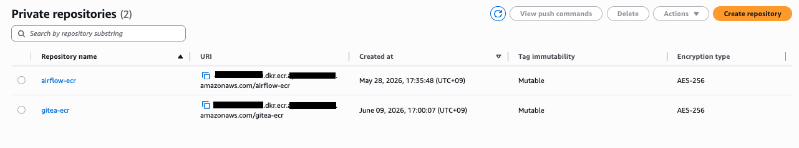

---
### Stage 3 - Set up RDS, Redis and run airflow-init task

##### RDS
1. Create RDS
```ruby
terraform apply -target=aws_db_instance.airflow_db
terraform apply -target=aws_vpc_security_group_ingress_rule.rds_allow_airflow_init_sg  --auto-approve
```
2. Test connection to RDS
   
- register ssh config in `~/.ssh/config`
```ruby
Host bastion
  HostName <bastion_public_ip>
  User ec2-user
  IdentityFile ~/.ssh/<key_pair>.pem

Host airflow-db
	HostName <bastion_public_ip>
	User ec2-user
	IdentityFile ~/.ssh/<key_pair>.pem
	LocalForward 5432 <rds-endpoint>.rds.amazonaws.com:5432
```
- SSH into RDS from terminal
```ruby
ssh airflow-db
```
- verify if the tunnel is active from a new terminal. The output confirms the local port `5432` is forwarded to the private RDS through bastion.
```ruby
# local new terminal
lsof -i :5432
```
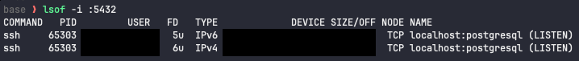
- connect to RDS from terminal
```ruby

#  local new terminal: password can be found in secret manager or terraform output
psql -h localhost -p 5432 -U airflow airflow
```
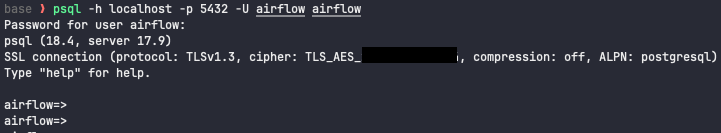
##### Redis
Create Redis (ElasticCache)
```ruby
terraform apply -target=aws_elasticache_cluster.redis --auto-approve
terraform apply -target=aws_vpc_security_group_egress_rule.redis_allow_all_traffic_ipv4 --auto-approve
```
##### ECS Cluster
Create ECS Cluster 
```ruby
terraform apply -target=aws_ecs_cluster.airflow --auto-approve
```
##### Airflow init-task
5. Create airflow init task definition
```ruby
terraform apply -target=aws_ecs_task_definition.airflow_init --auto-approve
terraform apply -target=aws_vpc_security_group_egress_rule.init_allow_all_traffic_ipv4  --auto-approve
terraform apply -target=aws_iam_role_policy_attachment.ecs_task_execution  --auto-approve
terraform apply -target=aws_iam_role_policy.access_secret_manager  --auto-approve
terraform apply -target=aws_iam_role_policy.access_s3  --auto-approve
```
`terraform apply -target` is used only to demonstrate the infrastructure build-up stage by stage.

6. Manually start the ECS task `airlow-init`
   - this task will run `airflow_init.sh` which init the DB and create airflow user
```ruby
# fill in private subnets and security group for the init task
aws ecs run-task \
  --cluster airflow-ecs \
  --task-definition airflow-init \
  --launch-type FARGATE \
  --network-configuration \
  "awsvpcConfiguration={
      subnets=[subnet-123,subnet-456,subnet-789],
      securityGroups=[sg-123456],
      assignPublicIp=DISABLED
  }"
  
# verify status
aws ecs describe-tasks \
--cluster airflow-ecs \
--tasks <task_arn>
```
- you can check cloudwatch logs for the task: go to `cloudwatch` -> log group `/ecs/airflow-init`. 
  Result should show:
```ruby
User "admin" created with role "Admin"
```
- Then, the airflow-init task will stop and show `Essential container in task exited`

##### Gitea
1. Connect to RDS Postgres from bastion
```ruby
# connect to RDS
psql \
  "host=<rds-endpoint> \
   port=5432 \
   dbname=airflow \
   user=<master-user> \
   sslmode=require"
```

2. Create Gitea user and Gitea database in RDS Postgres.
```sql
-- create user
CREATE ROLE gitea  
LOGIN  
PASSWORD 'gitea';

-- verify user
SELECT rolname  
FROM pg_roles  
WHERE rolname = 'gitea';

-- create db
CREATE DATABASE gitea;

-- connect to another database instead of gitea
\c airflow

-- alter owner
ALTER DATABASE gitea OWNER TO gitea;

-- connect to database gitea
\c gitea

-- switch to user gitea
set role gitea;

-- create schema
CREATE SCHEMA gitea;

-- verify
SELECT *
FROM information_schema.schemata  
WHERE schema_name = 'gitea';

-- set default search path (default schema), original default is public
ALTER ROLE gitea  
SET search_path TO gitea; -- now even you dont specify schema, psql know you mean schema gitea

-- reconnect as gitea, then verify search path
SHOW search_path;
```
*Note:* On RDS, the master user is **not a true superuser**, that means this master user does **not** have permission to create a database **owned** by another role but it usually has enough privileges to create databases. you can't do `CREATE DATABASE gitea OWNER gitea;` directly.
=> Create the database first, then transfer ownership.

3. test login as gitea user
```ruby
psql \
  "host=<rds-endpoint> \
   port=5432 \
   dbname=gitea_db \
   user=gitea \
   sslmode=require"
```
---
### Stage 4 - Set up the remaining blocks

- Set up all the remaining blocks (airflow & gitea ecs tasks, ALB, ACM, EFS, CloudMap)
```ruby
terraform apply --auto-approve
```
##### Stage 4a - Set up ECS tasks

- I choose AWS Fargate as the compute 
	- we just request the resources we need (CPU & Memory)
	- Use spot instance `capacity_provider = "FARGATE_SPOT"` to save money (for testing)
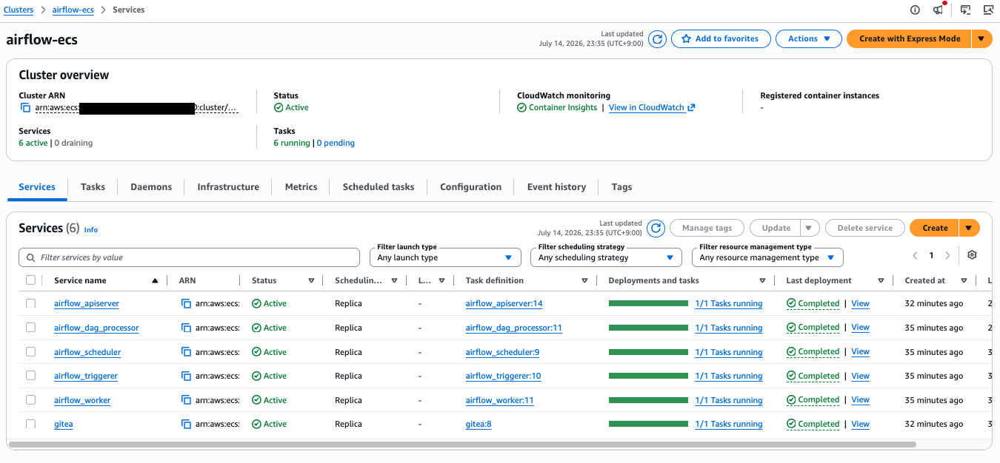

##### Stage 4b - Set up EFS

- Flow
```ruby
EFS  (Mount Targets  +  EFS Access Point  +  /data mount)
  ↓
Gitea Task Volume (gitea-data)
  ↓
Gitea Container Mount (/data)
```
=> Everything under `/data` in gitea container will now be persisted in EFS.

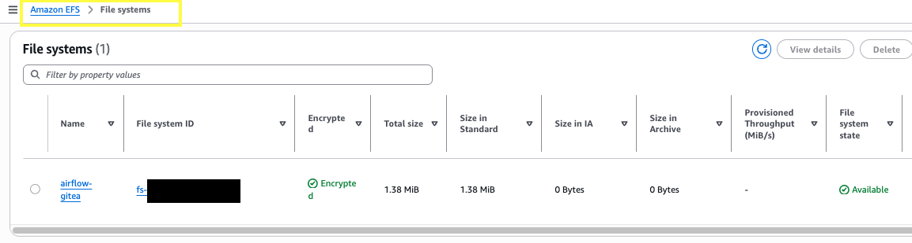

- Inspect ownership of the data directory in gitea container in order to determine what uid to be used at EFS `access point` 
```ruby
# inside gitea container

# look for the Gitea process
ps aux
#  19 git       0:02 /usr/local/bin/gitea web

# switch user
su git

id
# uid=1000(git) gid=1000(git) groups=1000(git),1000(git)

grep git /etc/passwd
# git:x:1000:1000::/data/git:/bin/bash

ls -ld /data
# root
```
##### Stage 4c - Set up ALB

- approach
```ruby
Public ALB  
+ HTTPS listener (w/ ACM cert)
+ ALB security group ingress  (only allow my IP)
```

- Flow
```
ALB
├── :80  
│    └── Redirect -> 443  
│
└── :443
	 ├─ Host = airflow.example.com -> airflow-tg -> airflow-container
	 ├─ Host = gitea.example.com -> gitea-tg -> gitea-container
	 └─ Default -> fixed-response 404


https://airflow.example.com → ALB HTTPS listener → HTTP inside VPC -> Airflow ECS service  
https://gitea.example.com → same ALB HTTPS listener → HTTP inside VPC -> Gitea ECS service
```

1. Create a self-signed certificate, import to ACM and annotate the ALB listener to use the ACM cert ARN.
   - create certificate locally
   - import the cert to ACM and copy the cert ARN value.
   - then add the cert to ALB listener:  `certificate_arn = var.airflow_cert_arn`
```ruby
# private key
openssl genrsa -out airflow.key 2048
# use the private key to generate a self-signed cert
openssl req -new -x509 -key airflow.key -out airflow.crt -days 365 -subj "/CN=airflow.example.com"

# repeat for gitea
openssl genrsa -out gitea.key 2048
openssl req -new -x509 -key gitea.key -out gitea.crt -days 365 -subj "/CN=gitea.example.com"
```

```ruby
# terraform code for ALB listener
resource "aws_lb_listener" "https" {
  load_balancer_arn = aws_lb.alb.arn
  port              = 443
  protocol          = "HTTPS"
  
  certificate_arn   = var.airflow_cert_arn
  ssl_policy      = "ELBSecurityPolicy-TLS13-1-2-2021-06"
```

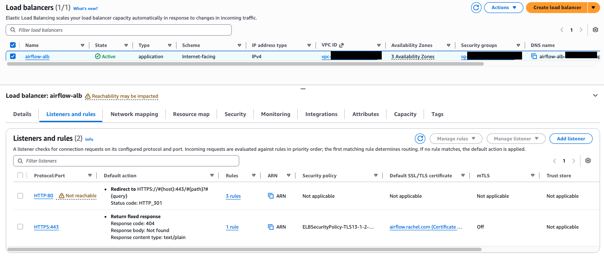

2. When ALB is provisioned, get the IP of the ALB.
```ruby
nslookup airflow-alb-xxx.<region_name>.elb.amazonaws.com
```

3. Update the local `/etc/hosts` file to map ALB IP to the airflow & gitea hostname.
```ruby
sudo vi /etc/hosts

# @hosts file, add the IP
12.34.56.78 airflow.example.com
12.34.56.78 gitea.example.com
```

4. Go to chrome browser and enter airflow URL.
```ruby
https://airflow.example.com
```

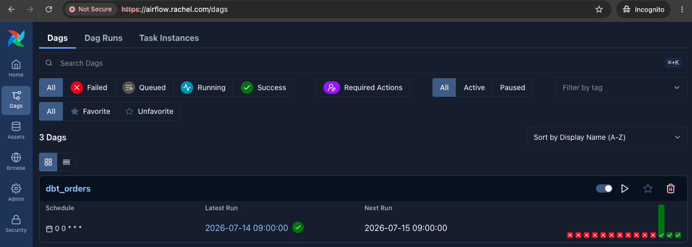

5. Go to chrome browser and enter gitea URL.
```ruby
https://gitea.example.com
```
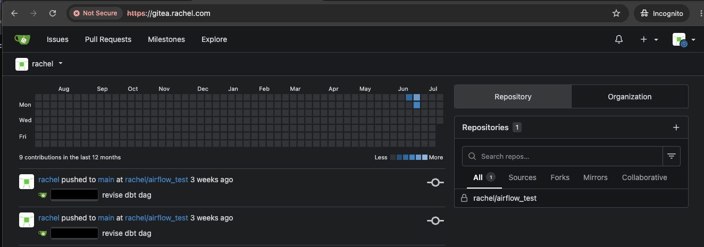

##### Stage 4d - Set up CloudMap (aws service discovery service)

**Why CloudMap?**
ECS task IPs will change, so if you configure Airflow to reach Gitea via IP, the communication will break when Gitea IP changes. Cloud Map provides a stable DNS name so Airflow can always locate the current Gitea task.

`CloudMap` will update the IP tied to Gitea ECS service. From Airflow perspective, Gitea remains as
```python
repo_url = "http://gitea.airflow.local:3000/bee/airflow_test.git"
```
Airflow never cares about the IP of Gitea.

When Gitea starts:

```text
Gitea ECS Service
   ↓
Cloud Map
   ↓
gitea.airflow.local
   ↓
10.0.1.123
```

When Gitea restarts:

```text
Gitea ECS Service
   ↓
Cloud Map updates
   ↓
gitea.airflow.local
   ↓
10.0.2.88
```

Similarly, the airflow worker/triggerer/dag processor/scheduler can reach airflow api server via service discovery (important in remote logging).

1. You create a private DNS zone `airflow.local` inside the VPC. 

```ruby
resource "aws_service_discovery_private_dns_namespace" "main" {
  name = "airflow.local"
  vpc  = module.vpc.vpc_id
}
```
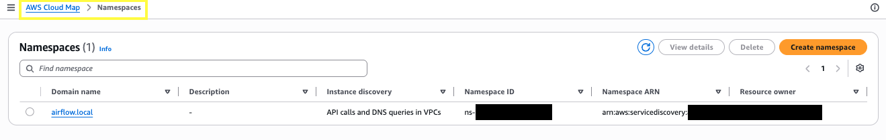

2. Create  `aws_service_discovery_service` gitea.
   => This creates `gitea.airflow.local`.
```ruby
resource "aws_service_discovery_service" "gitea" {
  name = "gitea"
...
```

3. Create  `aws_service_discovery_service` airflow_api.
```ruby
resource "aws_service_discovery_service" "airflow_api" {
  name = "airflow-api" # create airflow-api.airflow.local
  ...
```
4. Register the service to the ECS service of gitea and airflow apiserver.

- gitea
```ruby
resource "aws_ecs_service" "gitea" {
	...
	service_registries {
	  registry_arn = aws_service_discovery_service.gitea.arn
	}
}
```
=> ECS automatically registers/deregisters the task IP when ECS task starts/stops. 

- airflow_apiserver
```ruby
resource "aws_ecs_service" "airflow_apiserver" {
...

  # so that airflow worker/triggerer/dag processor/scheduler can reach api server via service discovery (connect Amazon ECS services with Cloud Map)
  service_registries {
    registry_arn = aws_service_discovery_service.airflow_api.arn
  }
```
5.  Test connection  from inside the Airflow container.

- connection to Gitea from airflow container
```ruby
# enter airflow container
aws ecs execute-command \
  --cluster airflow-ecs \
  --task <task_arn> \
  --container airflow-apiserver \
  --interactive \
  --command "/bin/bash"

# inside airflow container
su airflow

getent hosts gitea.airflow.local  
curl -I http://gitea.airflow.local:3000  
git ls-remote http://gitea.airflow.local:3000/demo/airflow_test.git
```

- connection to Airflow apiserver from other airflow containers
```ruby

# inside airflow container
su airflow

curl -I http://airflow-api.airflow.local:8080/execution/
```
##### Stage 4e - Set up GitDagBundle

For Airflow 3.x, we can use `GitDagBundle` which allows Airflow to treat Git repository as a DAG source directly.

**Why GitDagBundle?**
GitDagBundle removes the need for shared DAG storage (such as EFS) for Airflow itself by allowing the DAG Processor to synchronize directly from Git. In this exercise, EFS is only used for persistent Gitea storage.

For the set up, we need the git repo_url + Airflow connection for the private git repo. If the git repo is public, we probably don't need the Airflow connection part.

```ruby
# Flow
Git Push
      ↓
Gitea
      ↓
GitDagBundle
      ↓
Dag Processor
      ↓
Scheduler
```
- `repo_url` (git repo) must be reachable **from the Airflow container**. 
  =>  I use `service discovery` to connect Amazon ECS services with DNS names.
  repo_url = "http://gitea.internal:3000/example/airflow_test.git"

1. Set up Git connection in Airflow
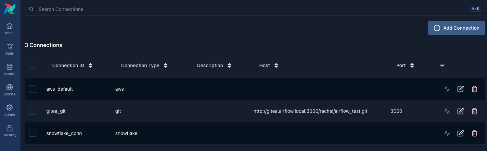


2. Configure the DAG bundle in Airflow config via ECS env vars setting and then RESTART the Airflow ECS services. 
   => The Airflow DAG processor will clone the repository and start discovering DAGs.
```ruby
# terraform code for ECS env vars
    {
      name  = "AIRFLOW__DAG_PROCESSOR__DAG_BUNDLE_CONFIG_LIST"
      value = jsonencode([
        {
          name      = "dags-folder"
          classpath = "airflow.providers.git.bundles.git.GitDagBundle"
          kwargs = {
            tracking_ref = "main"
            repo_url = "http://gitea.airflow.local:3000/demo/airflow_test.git"
            git_conn_id  = "gitea_git"
            refresh_interval = 30
          }
        }
      ])
    }
```
- Make sure the **Gitea security group allows inbound 3000 from the Airflow security group**.
- In ECS cluster @AWS console, under gitea ecs service -> configuration and networking -> you should find `Service discovery` .  Also, in Cloud Map -> namespaces -> check `airflow.local` -> select service `gitea` -> `service instances` should present.

---
### Stage 5 - Test dbt + Snowflake pipeline on Airflow

1. Create dbt dag and dbt models in following structure
```ruby
<tracking_repo>/
  dags/
    dbt/
      dbt_orders_dag.py

  dbt/
    my_dbt_project/
	  models/
      dbt_project.yml
```
2. Push example dag and dbt project to Gitea.
3. Check if the dag shows up on Airflow UI.
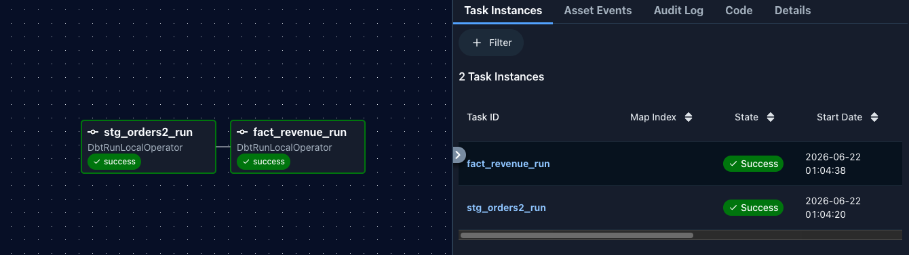

4. Create connection in Airflow for Snowflake.
5. Trigger the dag run.
6. Check the task log.
7. Check if data successfully loaded to Snowflake.
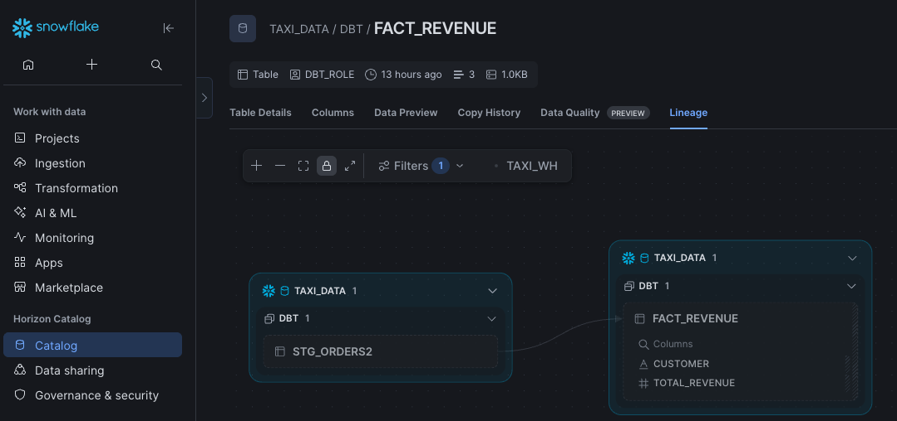
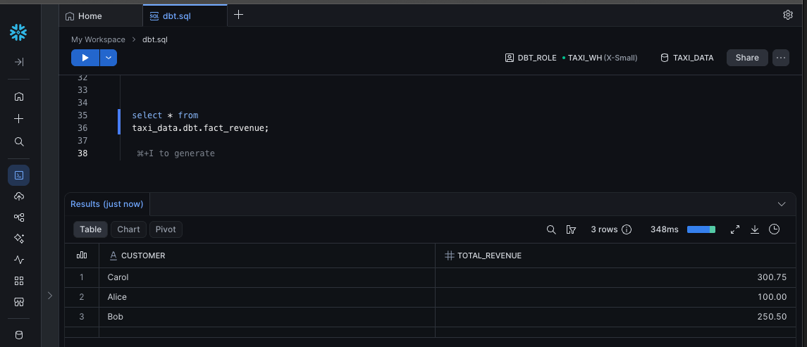

---
## Additional: debug container via SSM

I want to go into the airflow container, and verify the ALB target group's health check path from inside the container.
```ruby
curl http://localhost:8080/api/v2/monitor/health
```

To enter the airflow container, I would need to run`ECS Exec` command which uses AWS Systems Manager (SSM).

Flow
```
My laptop
      │
aws ecs execute-command
      │
      ▼
ECS Control Plane
      │
      ▼
SSM (Session Manager)
      │
 encrypted session
      │
      ▼
ECS Task (running container)
      │
      ▼
/bin/bash
```
We are not SSH-ing into the container. Instead, AWS CLI sends an `ecs execute-command` request to ECS. ECS then works with SSM, and SSM establishes an encrypted session to the running ECS task. The `/bin/bash` command is executed inside the container.

1. Add `AmazonSSMManagedInstanceCore` managed policy to the ecs task role (NOT the execution role).
```ruby
resource "aws_iam_role_policy_attachment" "access_ssm_airflow" {
  role = aws_iam_role.ecs_task_role_airflow.name

  # to execute "aws ecs execute-command"
  policy_arn = "arn:aws:iam::aws:policy/AmazonSSMManagedInstanceCore"

}
```
2. to ensure ECS task able to reach SSM, you need NAT gateway or following VPC endpoints.
```
com.amazonaws.<region>.ssmmessages
com.amazonaws.<region>.ssm
com.amazonaws.<region>.ec2messages
```
   => We have NAT gateway.

3. Install Session Manager plugin locally
```ruby
brew install session-manager-plugin

# verify
session-manager-plugin --version
```

4. To avoid ALB failed health check will make ECS to terminate the task. we can extend the `health_check_grace_period_seconds` which tell how long ECS should ignore ALB unhealthy status, so that ECS will not mark the current task failed and start a new task.

5.  Check the task arn using service name
```ruby
# for long running service
 aws ecs list-tasks \
 --cluster airflow-ecs \
 --service-name airflow_apiserver
```
- you can connect to the container and debug until the grace period expires.

6. Connect to the container
```ruby
aws ecs execute-command \
  --cluster airflow-ecs \
  --task <ecs_task_arn> \
  --container airflow-apiserver \
  --interactive \
  --command "/bin/bash"
  
```
7. Check if airflow is listening & working properly from inside the airflow container.
   
```ruby
# inside container
# switch to airflow user (NOT root user)
su airflow

curl http://localhost:8080

# verify the ALB target group's health check path
curl http://localhost:8080/api/v2/monitor/health
```
=> if you get response, then airflow is working fine.

## Key Takeaways

- Deployed Airflow 3.2 on ECS Fargate using Celery Executor.
- Provisioned AWS infrastructure using Terraform.
- Integrated GitDagBundle with a self-hosted Gitea repository.
- Configured Cloud Map for service discovery between ECS services.
- Used ECS Exec and AWS Systems Manager to troubleshoot running containers.
- Integrate dbt with Snowflake on Airflow

---
## Cleanup

```ruby
terraform destroy  --auto-approve
```

---
## Troubleshooting

##### issue #1 - task log failed with No host supplied

- Error message:
```
requests.exceptions.InvalidURL: Invalid URL 'http://:8793/log/dag_id=dbt_orders/run_id=manual__2026-06-21T07:58:44.858203+00:00/task_id=stg_orders2_run/attempt=1.log': No host supplied
```

- Why?
Worker does not have a proper `hostname_callable`. Usually, we should have `http://<worker-host>:8793/log/...`
```
Airflow UI/api-server → tries to read worker log → http://<worker-host>:8793/log/...
```
But the URL became
```
http://:8793/log/...
```
That means `<worker-host>` was missing.

So, why the UI was showing `http://:8793`?
Because `remote log` reading/writing was failing during task execution, then UI falls back to served local logs.

=> Need to enable remote logging properly.

Details here: [Troubleshootings](Troubleshootings.md).

---
## References

- https://www.dataquest.io/blog/deploying-airflow-to-the-cloud-with-amazon-ecs-part-iii/
- https://github.com/vcacereschian/airflow_ecs/tree/master/infrastructure
- https://github.com/aws-samples/aws-ecs-cicd-terraform/tree/master/terraform
- https://medium.com/machine-learning-reply-dach/airflow-deploying-dags-in-aws-1c373860ddbe
- https://sattlub123.medium.com/terraform%EC%9D%84-%ED%99%9C%EC%9A%A9%ED%95%9C-aws-ecs-fargate-%EC%9D%B8%ED%94%84%EB%9D%BC-%EB%B0%B0%ED%8F%AC-9eadf2863e10
- https://docs.aws.amazon.com/AmazonECS/latest/developerguide/service-discovery.html